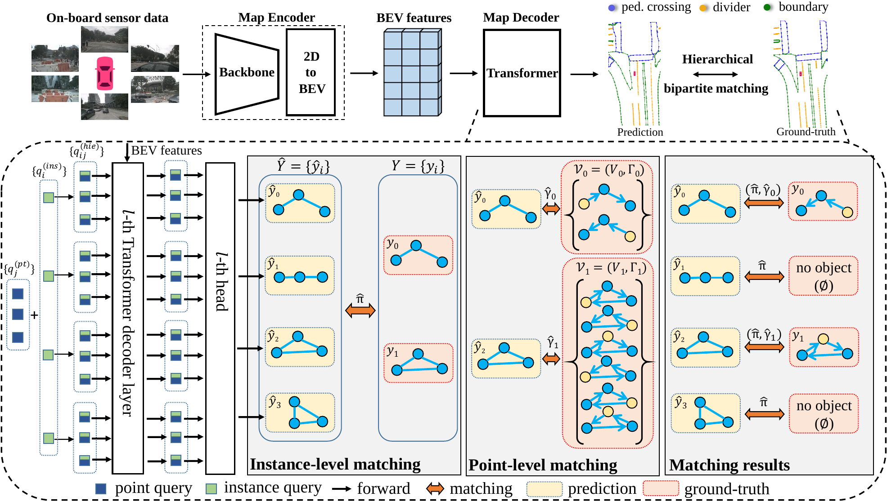

<div align="center">
<h1>MapTR </h1>
<h3>Structured Modeling and Learning for Online Vectorized HD Map Construction</h3>

[Bencheng Liao](https://github.com/LegendBC)<sup>1,2,3</sup> \*, [Shaoyu Chen](https://scholar.google.com/citations?user=PIeNN2gAAAAJ&hl=en&oi=sra)<sup>1,3</sup> \*, [Xinggang Wang](https://xinggangw.info/)<sup>1 :email:</sup>, [Tianheng Cheng](https://scholar.google.com/citations?user=PH8rJHYAAAAJ&hl=zh-CN)<sup>1,3</sup>, [Qian Zhang](https://scholar.google.com/citations?user=pCY-bikAAAAJ&hl=zh-CN)<sup>3</sup>, [Wenyu Liu](http://eic.hust.edu.cn/professor/liuwenyu/)<sup>1</sup>, [Chang Huang](https://scholar.google.com/citations?user=IyyEKyIAAAAJ&hl=zh-CN)<sup>3</sup>
 
<sup>1</sup> School of EIC, HUST, <sup>2</sup> Institute of Artificial Intelligence, HUST, <sup>3</sup> Horizon Robotics

(\*) equal contribution, (<sup>:email:</sup>) corresponding author.

ArXiv Preprint ([arXiv 2208.14437](https://arxiv.org/abs/2208.14437))

</div>

#
### News

* **`11 Nov, 2022`:** We release an initial version of MapTR.
* **`31 Aug, 2022`:** We released our paper on Arxiv. Code/Models are coming soon. Please stay tuned! ☕️


## Introduction
<div align="center"><h4>MapTR is a simple, fast and strong online vectorized HD map construction framework.</h4></div>


We present MapTR, a structured  end-to-end framework for efficient online vectorized HD map construction. 
We propose a unified  permutation-based modeling approach,
*ie*, modeling map element as a point set with a group of equivalent permutations, which avoids the definition ambiguity of map element and eases learning.
We adopt a hierarchical query embedding scheme to flexibly encode structured map information and perform hierarchical bipartite matching for map element learning. MapTR achieves the best performance and efficiency among existing vectorized map construction approaches on nuScenes dataset. In particular, MapTR-nano runs at real-time inference speed ( $25.1$ FPS ) on RTX 3090, $8\times$ faster than the existing state-of-the-art camera-based method while achieving $3.3$ higher mAP.
MapTR-tiny significantly outperforms the existing state-of-the-art multi-modality method by $13.5$ mAP while being faster.
Qualitative results show that MapTR maintains stable and robust map construction quality in complex and various driving scenes. MapTR is of great application value in autonomous driving. 

## Models
> Results from the paper


| Method | Backbone | Lr Schd | mAP| FPS|memroy | 
| :---: | :---: | :---: | :---: | :---:|:---:|
| MapTR-nano | R18 | 110ep | 44.2 | 25.1| 11907M (bs 24) |
| MapTR-tiny | R50 | 24ep | 50.3 | 11.2| 10287M (bs 4) | 
| MapTR-tiny | R50 | 110ep | 58.7|11.2| 10287M (bs 4)|

**Notes**: 

- FPS is measured on NVIDIA RTX3090 GPU with batch size of 1 (containing 6 view images).
- All the experiments are performed on 8 NVIDIA GeForce RTX 3090 GPUs. 

> Results from this repo, we refactor the code and rerun the experiments, the results are slightly different.

| Method | Backbone | Lr Schd | mAP| FPS|memroy | Config | Download |
| :---: | :---: | :---: | :---: | :---:|:---:| :---: | :---: |
| MapTR-nano | R18 | 110ep |[coming soon]  | 25.1| 11907M (bs 24) |[config](projects/configs/maptr/maptr_nano_r18_110e.py) |[coming soon] |
| MapTR-tiny | R50 | 24ep | 50.0 | 11.2| 10287M (bs 4) | [config](projects/configs/maptr/maptr_tiny_r50_24e.py)|[model](https://drive.google.com/file/d/1n1FUFnRqdskvmpLdnsuX_VK6pET19h95/view?usp=share_link) / [log](https://drive.google.com/file/d/1nvPkk0EMHV8Q82E9usEKKYx7P38bCx1U/view?usp=share_link) |
| MapTR-tiny | R50 | 110ep | 59.3 |11.2| 10287M (bs 4)|[config](projects/configs/maptr/maptr_tiny_r50_110e.py) |[model](https://drive.google.com/file/d/1SCF93LEEmXU0hMwPiUz9p2CWbL1FpB1h/view?usp=share_link) / [log](https://drive.google.com/file/d/1TQ4j_0Sf2ipzeYsEZZAHYzX4dCUaBqyp/view?usp=share_link) |

## Qualitative results on nuScenes val set
<div align="center"><h4>MapTR maintains stable and robust map construction quality in various driving scenes.</h4></div>


### *Sunny&Cloudy*
https://user-images.githubusercontent.com/31960625/187059686-11e4dd4b-46db-4411-b680-17ed6deebda2.mp4

### *Rainy*
https://user-images.githubusercontent.com/31960625/187059697-94622ddb-e76a-4fa7-9c44-a688d2e439c0.mp4

### *Night*
https://user-images.githubusercontent.com/31960625/187059706-f7f5a7d8-1d1d-46e0-8be3-c770cf96d694.mp4


## Getting Started
- [Installation](docs/install.md)
- [Prepare Dataset](docs/prepare_dataset.md)
- [Train and Eval](docs/train_eval.md)


## Catalog

- [ ] multi-modal checkpoints
- [ ] multi-modal code
- [ ] argoverse2 dataset 
- [x] Nuscenes dataset 
- [x] MapTR checkpoints
- [x] MapTR code
- [x] Initialization

## Citation
If you find MapTR is useful in your research or applications, please consider giving us a star 🌟 and citing it by the following BibTeX entry.
```bibtex
@article{MapTR,
  title={MapTR: Structured Modeling and Learning for Online Vectorized HD Map Construction},
  author={Liao, Bencheng and Chen, Shaoyu and Wang, Xinggang and Cheng, Tianheng, and Zhang, Qian and Liu, Wenyu and Huang, Chang},
  journal={arXiv preprint arXiv:2208.14437},
  year={2022}
}
```
